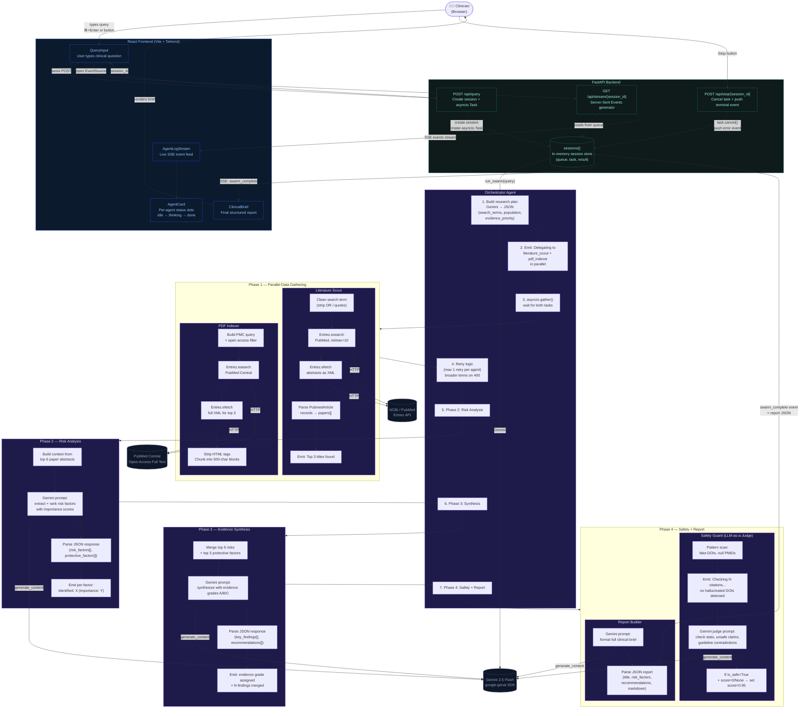

# MediSwarm — Architecture Diagram

Full end-to-end flow from user query to clinical brief.

## Agent Responsibility Summary

| Agent | Input | Output | LLM call |
|-------|-------|--------|-----------|
| **Orchestrator** | user query | research plan + coordination | yes — plan |
| **Literature Scout** | search terms | papers[] with abstracts | no (Entrez) |
| **PDF Indexer** | search terms | text chunks[] from PMC | no (Entrez) |
| **Risk Analyst** | papers + chunks | ranked risk_factors[] | yes |
| **Synthesizer** | risk factors + papers | key_findings[], recommendations[] | yes |
| **Safety Guard** | synthesis JSON | validated synthesis + safety_score | yes (judge) |
| **Report Builder** | validated synthesis | final clinical brief JSON | yes |

## SSE Event Types

| Event | Trigger | Frontend effect |
|-------|---------|-----------------|
| `agent_start` | agent begins | amber dot, "starting" label |
| `agent_thinking` | agent emits reasoning | amber pulse dot, message preview |
| `agent_done` | agent finishes | green dot, "done" label |
| `swarm_complete` | full pipeline done | orchestrator turns green, brief renders |
| `error` | any failure or user stop | red dot, stream closes |
